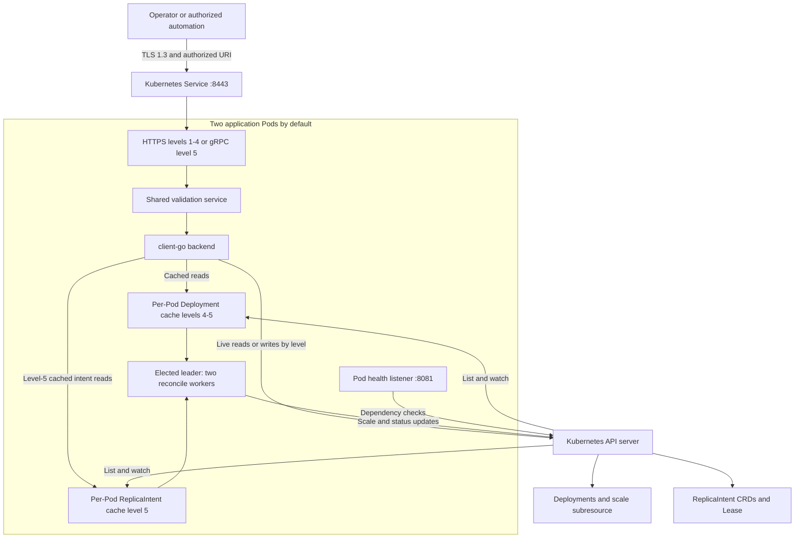
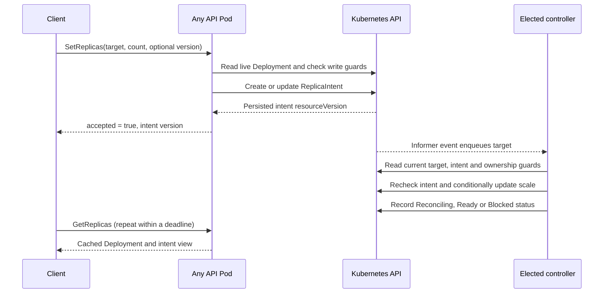

# RFD 0001 - Replica Control system design

**Date:** 2026-09-20. **Project:** TeleportFDE, an independent educational Go
implementation of the SRE challenge levels 1–5.

This document follows [Teleport's RFD guidance](https://github.com/gravitational/teleport/blob/master/rfd/0000-rfds.md).
The number is local to this repository. The reference implementation already
exists; `draft` describes this document's pending review, a local adaptation of
the upstream lifecycle. It does not imply Teleport approval or production
readiness. Sections describe current behavior unless explicitly labeled proposed
or unverified.

**Authorship and assistance:** Jamie Holland architected the system and directed
the work. AI assistance engineered the implementation of Jamie's architecture
and instructions, including code, tests and documentation, and checked technical
claims against source inspection and available execution evidence. Jamie Holland
is the author and system architect; AI assistance is disclosed as implementation
and verification support. Recorded checks establish only the behavior they
actually exercised, with remaining gaps stated explicitly.

## Required Approvers

Proposed review responsibilities; no approvals have been recorded:

| Responsibility | Decision | Reviewer |
|---|---|---|
| Project owner | Confirm intended challenge level and educational scope | Jamie Holland; pending |
| Go/Kubernetes engineering | API contracts, concurrency and reconciliation | To be assigned |
| Security | Trust boundaries, authorization and failure behavior | To be assigned |
| SRE | Deployment lifecycle, recovery and evidence limits | To be assigned |

Any assessment-specific reviewer and submission requirements must be agreed
separately with the hiring team.

## UX

### An automation agent changes an authorized target

An operator supplies the target namespace, Deployment, replica count and client
credentials. An automation agent reads this contract and the CLI help, then:

1. Reads the target with `replicactl get`; an omitted replica count is never
   interpreted as a request for zero.
2. Checks that the requested action remains within the operator's authorization.
   The service has one operator identity, not per-agent or per-namespace grants.
3. For an existing level-5 intent, uses its `intentVersion` as
   `--expected-version` on `set`. A conflict requires reading and reconsidering
   the latest state, not silently dropping the condition.
4. Interprets `accepted: true` as saved intent. It polls `get` until the desired
   count is observed and reconciliation reports `Ready`, with an explicit deadline.
5. Reports a blocked target, timeout or authentication failure with diagnostics.
   It does not bypass protection, remove an HPA, or acquire broader credentials.

This is a supported CLI interaction pattern, not an implemented autonomous agent
or human-approval subsystem. Whoever holds the operator certificate can perform
the service's allowed writes.

### Day one: run a disposable local exercise

Complete the platform-specific setup in the [root README](../README.md) first.
The following Linux/WSL commands run from the repository root and derive paths
from that directory:

```bash
repo_root="$(pwd)"
bash "$repo_root/scripts/dev.sh" quality vuln
bash "$repo_root/scripts/dev.sh" integration LEVEL=2 CLUSTER=sre-rfd
bash "$repo_root/scripts/dev.sh" clean-cluster CLUSTER=sre-rfd
```

The integration target builds the image and host tools, creates a real KIND
cluster, provisions development certificates, installs the chart, and exercises
a disposable target Deployment. It cleans up its test namespace; the final
command deletes only the named development cluster. Generated PKI is retained.
No Azure subscription or external cluster credentials are required.

On Windows, the corresponding integration entry point is:

```powershell
$repoRoot = (Get-Location).Path
& (Join-Path $repoRoot 'scripts/dev.ps1') -MakeArguments @(
    'integration', 'LEVEL=2', 'CLUSTER=sre-rfd'
)
```

The PowerShell wrapper invokes WSL. GNU Make executes on the Linux host or CI
runner; it is not included in the application runtime image.

### Day two: inspect and change a level-5 target

For an interactive session, deploy level 5 and build the host CLI:

```bash
repo_root="$(pwd)"
bash "$repo_root/scripts/dev.sh" deploy build LEVEL=5 CLUSTER=sre-rfd
source "$repo_root/scripts/dev-env.sh"
kubectl --context kind-sre-rfd -n replica-system \
  port-forward service/replica-control 18443:8443
```

Leave that terminal running. In a second Linux/WSL terminal at the repository
root, inspect the service. The example target `demo/web` must already exist in
this development cluster and be eligible for scaling; the service does not
create workloads:

```bash
repo_root="$(pwd)"
client=("$repo_root/.bin/replicactl" --addr localhost:18443 \
  --server-name localhost --ca "$repo_root/.local/pki/ca.crt" \
  --cert "$repo_root/.local/pki/client.crt" --key "$repo_root/.local/pki/client.key")
"${client[@]}" health
"${client[@]}" list demo
"${client[@]}" get demo web
```

Successful RPCs print protobuf JSON to stdout. For an existing intent, copy the
opaque `intentVersion` from `get` into the following variable before running the
conditional write. The placeholder below is not a usable version:

```bash
intent_version='<intentVersion from the preceding get>'
"${client[@]}" --expected-version "$intent_version" set demo web 3
"${client[@]}" get demo web
```

If no intent exists, the first `set` omits `--expected-version`. That is an
unconditional write and can race another operator; this API does not offer a
create-only CLI flag. Subsequent updates should use the returned intent version.
Neither a successful write nor one immediate read proves convergence. Repeat
the read with bounded polling and inspect Deployment events if progress stalls.

Illustrative excerpts, not measured responses:

```json
{"namespace":"demo","name":"web","replicas":3,"version":"12345","accepted":true}
```

```json
{"replicas":3,"readyReplicas":3,"availableReplicas":3,"desiredReplicas":3,"intentVersion":"12348","reconcilePhase":"Ready"}
```

The version can change again when the controller writes status. CLI flags precede
the command. RPC errors go to stderr with a nonzero exit code; a successful
health RPC can return `NOT_SERVING` with exit code zero, so callers must inspect
its JSON `status`. The offline [visual guides](../docs/visuals/index.html) explain
the architecture; they are not an administrative web interface.

### Failure and recovery experience

| Condition | Observable behavior | Operator response |
|---|---|---|
| Missing, expired or unauthorized certificate | Connection/authentication fails | Check local fixture validity, trust and URI identity; do not disable verification |
| Target absent or recreated | Not-found/conflict, or blocked intent with UID mismatch | Inspect the live object's UID and deliberately retire obsolete intent |
| Stale expected version | HTTP 409 or gRPC `Aborted` | Read current state and decide whether the change is still appropriate |
| HPA, protection or deletion conflict | Rejected write or `Blocked` reconciliation | Resolve workload ownership with its owner |
| Kubernetes unavailable | Recent dependency check expires; readiness withdraws | Restore connectivity; inspect logs and retry within a bounded budget |
| Intent accepted but Pods not ready | Desired and observed counts differ | Inspect scheduling, workload health and intent status; acceptance is not completion |
| Broken test port-forward | Harness fails with stage/tunnel logs | Repair connectivity; a refused connection is not evidence of TLS rejection |

## What

Replica Control exposes authenticated Kubernetes Deployment replica reads and
writes through five progressively richer development modes. This RFD records
the shared implementation, its contracts and tradeoffs, and the evidence needed
to review it.

## Why

The exercise demonstrates API design, Kubernetes integration, secure transport,
availability during deployment, caching, and durable reconciliation. A single
shared implementation makes the progression reviewable without maintaining five
diverging applications. Each [level directory](../levels/README.md) provides its
own guide, file map and configuration over that shared source.

This is a development reference for small clusters. It does not implement the
Teleport product, connect to a Teleport control plane, provide multi-tenant
authorization, or promise a production availability SLO. Assessment scope and
design approval remain separate decisions.

## Details

### Functional requirements and level boundaries

| ID | Requirement | Levels |
|---|---|---|
| FR-1 | Authenticate and authorize every operational API connection using mTLS | 1–5 |
| FR-2 | Read desired, ready and available Deployment replica counts | 1–5 |
| FR-3 | Validate and apply direct scale writes, including deliberate zero | 2–4 |
| FR-4 | List Deployments, optionally by namespace | 3–5 |
| FR-5 | Serve reads from per-Pod informer caches | 4–5 |
| FR-6 | Save replica intent and reconcile drift through an elected controller | 5 |
| FR-7 | Support readiness-aware rolling deployment and measured rollout checks | Rollout tests: 3–5 |

Levels 1–4 use HTTPS; level 5 uses gRPC instead of the REST routes. The binary's
`--level` selects behavior. All modes share startup, health and shutdown machinery.

### Architecture and ownership



[Server startup](../cmd/server/main.go) composes the transports, shared service,
backend and controller. [model.Backend](../internal/model/model.go) is the
transport-independent backend contract. The [service](../internal/service)
validates requests; [HTTP](../internal/httpapi) and [gRPC](../internal/grpcapi)
adapters map results and errors. The [Kubernetes adapter](../internal/kube),
[controller](../internal/controller) and [reconcile decisions](../internal/reconcile)
separate SDK operations from controller policy.

Kubernetes stores durable state. Informer caches are disposable, per Pod, and
cluster-wide. Levels 1–3 read live objects; levels 4–5 read caches while background
watches and health checks still contact Kubernetes. Deployment and intent views
are eventually consistent and not an atomic snapshot. There is no external
database or cache.

### API and concurrency contract

| Method | Route / RPC | Availability |
|---|---|---|
| GET | `/v1/namespaces/{namespace}/deployments/{name}/replicas` | Levels 1–4 |
| PUT | Same resource route | Levels 2–4 |
| GET | `/v1/deployments?namespace=demo` | Levels 3–4; omit namespace for all |
| RPC | `GetReplicas`, `SetReplicas`, `ListDeployments` | Level 5 |

HTTP PUT takes `{"replicas":3,"expectedVersion":"12345"}`. The version is optional;
the replica field is required, integer-valued and bounded to 0–1000. Zero is a
valid explicit request. Names must meet the model's Kubernetes-style DNS rules.
JSON decoding rejects unknown fields and trailing objects; it does not add
duplicate-key or case-alias rejection beyond Go's standard decoder.

For levels 2–4 the expected version belongs to the Deployment. For level 5 it
belongs to the ReplicaIntent, including status-related version changes. Versions
are opaque: clients must not compare them numerically or interchange them.
Unconditional writes are last-successful-write-wins. Direct scale success means
the desired count was written; level-5 success means the intent was persisted.
Neither promises ready Pods.

| Application error | HTTP | gRPC |
|---|---:|---|
| Invalid argument | 400 | `InvalidArgument` |
| Missing resource | 404 | `NotFound` |
| Version conflict | 409 | `Aborted` |
| Forbidden target | 403 | `PermissionDenied` |
| Dependency unavailable | 503 | `Unavailable` |
| Failed precondition | 412 | `FailedPrecondition` |
| Internal failure | 500 | `Internal` |

gRPC also maps cancellation/deadline errors explicitly. Request work uses a
ten-second default deadline. HTTP limits bodies to 4096 bytes and requires JSON
content type for writes. gRPC limits received messages to 4096 bytes, sent messages
to 8 MiB and concurrent streams to 128 per connection. Those bounds are not a
global client quota. Listing has no pagination.

### Proto Specification

The authoritative contract is [replicas.proto](../api/replicas/v1/replicas.proto),
with committed bindings under [gen/replicas/v1](../gen/replicas/v1). The current
contract is reproduced here for review; no new RPCs are proposed:

```proto
syntax = "proto3";
package replicas.v1;
option go_package = "example.com/replica-control/gen/replicas/v1;replicasv1";

service ReplicaService {
  rpc GetReplicas(GetReplicasRequest) returns (Deployment);
  rpc SetReplicas(SetReplicasRequest) returns (SetReplicasResponse);
  rpc ListDeployments(ListDeploymentsRequest) returns (ListDeploymentsResponse);
}
message GetReplicasRequest { string namespace = 1; string name = 2; }
message SetReplicasRequest {
  string namespace = 1;
  string name = 2;
  optional int32 replicas = 3; // Presence distinguishes missing from an intentional zero.
  string expected_version = 4; // ReplicaIntent resourceVersion, not Deployment version.
}
message ListDeploymentsRequest { string namespace = 1; } // Empty means all namespaces.
message Deployment {
  string namespace = 1;
  string name = 2;
  string uid = 3;
  string resource_version = 4;
  int32 replicas = 5;
  int32 ready_replicas = 6;
  int32 available_replicas = 7;
  optional int32 desired_replicas = 8;
  string intent_version = 9;
  string reconcile_phase = 10;
  int64 generation = 11;
  int64 observed_generation = 12;
}
message SetReplicasResponse {
  string namespace = 1;
  string name = 2;
  int32 replicas = 3;
  string version = 4;
  bool accepted = 5; // Persisted intent, NOT a guarantee that Pods are ready.
}
message ListDeploymentsResponse { repeated Deployment deployments = 1; }
```

### Persistent intent and reconciliation

The namespaced `replicas.reference.example.com/v1alpha1` ReplicaIntent has the
same name as its Deployment. Its specification contains immutable Deployment
name and UID plus the requested replica count. Schema validation enforces bounds
and matching resource names. A Deployment owner reference allows garbage
collection; intent must never transfer automatically to a replacement UID.



The controller rechecks UID, deletion, protected-target and HPA conditions. It
rereads intent before a scale update, uses UID/resourceVersion checks, retries
conflicts with a rate-limited queue, and skips identical status writes. Status
updates check the original intent UID/generation. A 30-second requeue revisits
targets even without a fresh event. `Ready` requires the intended spec count,
matching ready replicas, and observation of the Deployment generation.

There is no transaction across intent and Deployment. An intent can change
during a reconcile pass; later work converges to the latest intent. HPA detection
does not establish exclusive ownership atomically. Competing HPA/GitOps replica
management is unsupported.

Every Pod serves APIs and maintains caches; only the elected leader runs two
workers. A namespaced Lease uses a 15-second duration, ten-second renewal deadline
and two-second retry. Loss of leadership drains and exits. `ReleaseOnCancel` is
false to avoid releasing leadership before old work stops. Election is not strict
fencing; reconciliation must tolerate overlap and failover delay.

### Security and privacy

TLS 1.3 protects port 8443. Clients verify the server name; the server verifies
client chain, validity and client-auth EKU, then requires the exact URI SAN
`spiffe://replica-control.local/client/operator`. This identifier does not imply
a deployed SPIFFE identity system. The development generator issues P-256
certificates with purpose-specific EKUs, seven-day leaves and a 30-day CA.
Private keys remain outside Git; the server receives no CA private key.

RBAC grants Deployment reads, scale reads/updates and HPA inspection as needed;
level 5 adds intent creation/update, status updates and a namespace-scoped Lease.
The service has no intent-delete permission. Application guards reject system
namespaces and the `replicas.reference.example.com/protected: "true"` annotation.
These are broad cluster-operator permissions, not tenant isolation.

Workload names, counts, UIDs and version metadata can reveal infrastructure
information. API access therefore requires the operator identity. Logs and test
artifacts also require appropriate repository access. CI artifact selection
excludes private keys and Secret manifests. Generic internal errors are hidden,
but explicitly constructed application-error messages are returned verbatim;
developers must keep backend details out of those messages.

Automated certificate rotation/revocation, per-user authorization, identity rate
limits and a default NetworkPolicy are not implemented. Key/trust changes require
a rolling restart and deliberate client/server trust coordination. Review these
gaps before any use beyond the development scope.

### Availability, scale and operations

Readiness requires initial cache synchronization where applicable and a recent
successful live dependency check. Checks run every three seconds with a
two-second deadline; success ages out after twelve seconds. That establishes
recent connectivity, not proof that every cache entry is current. Liveness tests
the process independently. Port 8081 is for Pod health and is omitted from the
Service; gRPC health is also available through mTLS.

The chart defaults to two Pods, `maxUnavailable: 0`, `maxSurge: 1`, five-second
minimum readiness, a PodDisruptionBudget and preferred anti-affinity. SIGTERM
withdraws readiness, allows five seconds for propagation, then drains for up to
15 seconds within a 40-second Pod termination grace period. Availability assumes
spare capacity, working networking and compatible trust/protocols.

Each Pod caches cluster-wide resources. More API replicas multiply watch and
memory costs without increasing the single leader's two-worker concurrency.
Unpaginated lists and the gRPC response limit constrain large inventories. No
load-derived capacity or latency SLO has been established. Namespace scoping,
pagination and controller sharding would need a separate design and measurement.

### Build, CI and local environments

[toolchain.env](../toolchain.env) pins tools/images;
[go.mod](../go.mod) and [go.sum](../go.sum) select and verify Go dependencies.
The [development guide](../docs/DEVELOPMENT.md) maps requirements to setup,
host, build container and runtime. Host builds produce `server`, `replicactl`,
`probe` and `tlscheck`. The scratch runtime contains the first three plus CA
roots and runs as UID 65532; it has no shell, compiler or GNU Make.

[CI](../.github/workflows/ci.yaml) runs source-quality checks on branch pushes.
PR checks are off by default and enabled through the `ci:full` label. Main pushes,
including completed PR merges, version tags and enabled PRs also run container
checks and a five-level integration matrix after quality passes. Each matrix
job provisions its own real KIND cluster, not a mocked Kubernetes API. Levels
3–5 also run rollout checks. Manual branch runs can request the full suite;
main/tag runs remain full. There is no extra PR-closed run duplicating the merge's
main push. [CI controls](../docs/CI-CONTROLS.md) define selection and cancellation.
Cleanup runs regardless of success; selected diagnostic logs are uploaded for
seven days.

The integration harness owns and checks one port-forward subprocess per stage.
Negative TLS tests each use a separate tunnel and accept only the intended remote
certificate alert after validating fixtures. Connection refusal, EOF and missing
files fail the test. Normal authenticated access is retested on a fresh tunnel.

Rollout measurement uses an in-cluster probe against the Service, not a
Pod-selected tunnel. After its first successful request, Helm has 180 seconds to
upgrade. The harness signals `/probe --finish` inside the probe Pod, followed by
ten seconds of sampling. The probe has a 300-second deadline and the Job has
360 seconds. Missing acknowledgment or incomplete observation fails closed.

### Backward compatibility and rollback

Runtime levels are exercise configurations, not compatible API versions.
Switching between HTTP and gRPC can expose mixed protocols during a rolling
update; it is not covered by same-level rollout evidence. Use separate releases
or a planned interruption for that switch.

Keep protobuf field numbers stable and preserve optional replica presence.
Future fields should be additive where possible; pagination and authorization
would require explicit compatibility review. The intent CRD is `v1alpha1` and
has no version-conversion implementation. Its schema is installed separately
from normal chart resources; do not assume a Helm rollback reverses CRD changes.

Changing away from level 5 stops reconciliation but leaves existing intents in
Kubernetes. Returning to level 5 can resume them. An authorized Kubernetes
administrator must inspect or remove obsolete intents deliberately; removing an
intent leaves the last Deployment replica count intact. Never delete the shared
CRD as a shortcut for rolling back one release.

### AI proofing and agent skills

The CLI is noninteractive, deadline-bound and emits structured protobuf JSON;
int64 fields follow protobuf JSON string encoding. The proto and this document
provide discoverable contracts without an agent framework. There is no MCP
server or packaged agent skill in this repository.

A future skill could document credential inputs, target/version discovery,
bounded convergence polling and failure classification. It must preserve the
operator's authorization and cannot treat persisted intent or process exit zero
as universal evidence of successful scaling. Such a skill is proposed, not part
of this implementation.

### Audit events, observability and product usage

Current JSON application logs cover lifecycle, leadership and errors. Intent
status, Deployment status/events, health checks and per-stage CI logs support
diagnosis. The integration harness also emits verified API checkpoints, selected
fixture response fields and per-level GitHub summaries; see
[API test logs](../docs/API-TEST-LOGS.md). These are test evidence, not a live
service access log. There is no complete per-mutation audit trail, Prometheus endpoint,
distributed tracing pipeline or product-usage telemetry. Kubernetes audit logs
would require separate cluster configuration and are not claimed as supplied.

Proposed before broader operational use: record caller identity, target UID,
requested count, precondition, result and correlation ID for accepted/rejected
mutations, excluding credentials. Add request/error latency, queue depth,
reconcile outcome/age and cache/dependency-health metrics with bounded labels.
Define access and retention before collecting those events. No phone-home usage
reporting is needed for this local exercise.

### Alternatives and decisions

| Alternative | Decision and tradeoff |
|---|---|
| Direct `kubectl scale` only | Simpler for administrators; does not demonstrate a separate authenticated API or persistent intent reconciliation |
| Five independent applications | Shared source reduces drift; level guides expose the relevant subset, but reviewers must agree assessment scope |
| Only synchronous scale writes | Kept for levels 2–4; level 5 adds durable intent and drift correction at the cost of eventual completion |
| External cache/database | Kubernetes and informer caches suffice; avoiding another service trades away cross-resource transactional reads |
| Controller workers on every Pod | Lease election reduces duplicate work; failover delay and imperfect fencing remain explicit |
| Production identity/control plane | Outside the exercise; development PKI and one operator identity keep local setup reproducible |

## Test plan and evidence

The [integration report](../docs/INTEGRATION-VALIDATION.md) and
[source-hash receipt](../docs/validation/integration-summary.json) record the
2026-09-20 local Linux/ARM64 WSL run. These are dated results, not a new execution
caused by drafting this RFD:

| Verification | Recorded result |
|---|---|
| Formatting, generated bindings, race tests, vet, build, chart/workflow/harness checks and module verification | Passed; 29 Go files covered by formatting |
| Go vulnerability scan | No vulnerabilities reported at scan time |
| Docker test and runtime image | Passed on Linux/ARM64 |
| Real KIND integration | Levels 1–5 passed |
| Rollout level 3 | 144 requests, zero failures, longest 106.25 ms |
| Rollout level 4 | 146 requests, zero failures, longest 114.24 ms |
| Rollout level 5 | 137 requests, zero failures, longest 86.96 ms |
| Broken tunnel and missing fixture fault checks | Correctly failed the negative TLS test |

Level 5 also exercised drift correction, intent readiness and HPA conflict. At
the time of the receipt, GitHub-hosted AMD64 execution of those local changes
was not yet verified; consult actual CI runs for subsequent evidence.

The rollout probe samples fresh connections every 200 ms with a three-second
request deadline. gRPC `WaitForReady` can absorb a short interruption within that
bound. HTTP verifies status but does not fail on body-drain errors or validate
JSON; gRPC checks RPC success rather than complete response invariants. These
tests demonstrate sampled bounded completion, not uninterrupted service or a
production SLO.

### Remaining acceptance work

Before expanding the reference's claims, record tests for:

1. Leader loss and handover, including retained intent and bounded recovery.
2. Kubernetes connectivity loss/recovery, readiness withdrawal and cache behavior.
3. Certificate expiry and overlapping trust rotation without bypassing TLS.
4. Response-integrity failures, large inventories and sustained/concurrent load.
5. Concurrent intent/status updates, Deployment replacement and protocol migration.

Existing unit tests may cover parts of these behaviors; the items above require
explicit end-to-end evidence appropriate to each claim. Run the documented
quality, vulnerability, integration and rollout gates after relevant code changes.
Keep observed results separate from proposed acceptance criteria.

## Open review decisions

- Confirm the challenge level and named approvers before assessment submission.
- Decide whether stricter duplicate-key/case-sensitive HTTP input handling belongs
  in this reference's contract.
- Add a defensive fallback for unknown application error codes in the gRPC
  adapter before claiming every unexpected error produces `Internal`; the
  current status lookup has no explicit missing-key fallback.
- Decide whether to strengthen the rollout probe's payload/body checks before
  using it as evidence of response integrity.
- Keep production identity, audit, rotation and capacity work outside the claimed
  scope unless separately implemented and validated.

## Related documents

- [Implementation overview](../docs/DESIGN.md)
- [Level walkthrough](../docs/WALKTHROUGH.md)
- [Security notes](../docs/SECURITY.md)
- [Development environment and workflow](../docs/DEVELOPMENT.md)
- [Validation index and historical evidence boundaries](../VALIDATION.md)
- [Offline architecture visual guides](../docs/visuals/README.md)
